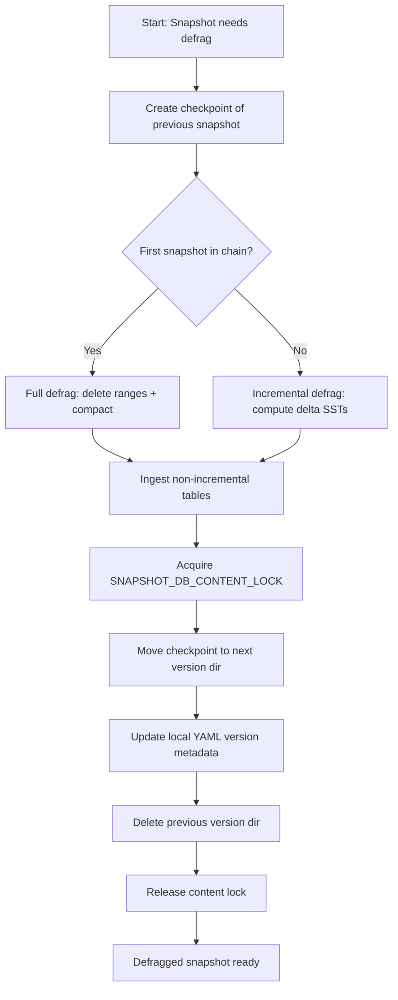
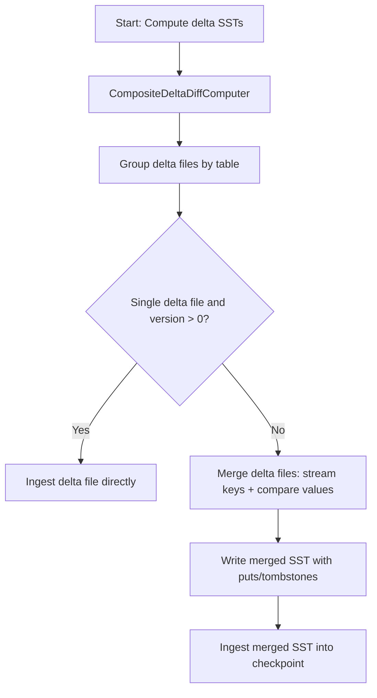
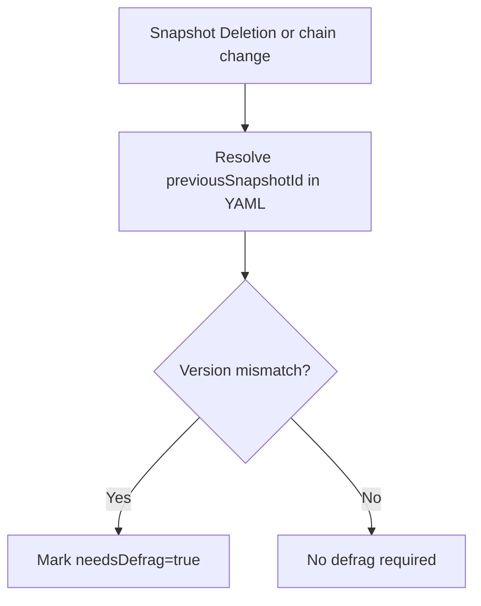

<!---
  Licensed to the Apache Software Foundation (ASF) under one or more
  contributor license agreements.  See the NOTICE file distributed with
  this work for additional information regarding copyright ownership.
  The ASF licenses this file to You under the Apache License, Version 2.0
  (the "License"); you may not use this file except in compliance with
  the License.  You may obtain a copy of the License at

      http://www.apache.org/licenses/LICENSE-2.0

  Unless required by applicable law or agreed to in writing, software
  distributed under the License is distributed on an "AS IS" BASIS,
  WITHOUT WARRANTIES OR CONDITIONS OF ANY KIND, either express or implied.
  See the License for the specific language governing permissions and
  limitations under the License.
-->
# Improving Snapshot Scale

[HDDS-13003](https://issues.apache.org/jira/browse/HDDS-13003)

# Problem Statement

In Apache Ozone, snapshots currently take a checkpoint of the Active Object Store (AOS) RocksDB each time a snapshot is created and track the compaction of SST files over time. This model works efficiently when snapshots are short-lived, as they merely serve as hard links to the AOS RocksDB. However, over time, if an older snapshot persists while significant churn occurs in the AOS RocksDB (due to compactions and writes), the snapshot RocksDB may diverge significantly from both the AOS RocksDB and other snapshot RocksDB instances. This divergence increases storage requirements linearly with the number of snapshots.

# Solution Proposal

The primary inefficiency in the current snapshot mechanism stems from constant RocksDB compactions in AOS, which can cause a key, file, or directory entry to appear in multiple SST files. Ideally, each unique key, file, or directory entry should reside in only one SST file, eliminating redundant storage and mitigating the multiplier effect caused by snapshots. If implemented correctly, the total RocksDB size would be proportional to the total number of unique keys in the system rather than the number of snapshots.

## Snapshot Defragmentation

Currently, snapshot RocksDBs have automatic RocksDB compaction disabled intentionally to preserve snapshot diff performance. Snapshot defragmentation builds a new snapshot version by starting from a checkpoint of the previous snapshot (or the snapshot itself for the first snapshot in a chain) and ingesting SST diffs for the tracked column families. The service iterates the active snapshot chain in order and rewrites snapshots into versioned checkpoint directories rather than a separate tree.

Note: Snapshot Defragmentation was previously called Snapshot Compaction earlier during the design phase. It is not RocksDB compaction. Thus the rename to avoid such confusion. We are also not going to enable RocksDB auto compaction on snapshot RocksDBs.

1. ### Snapshot local metadata (YAML) and versioning

   Snapshot defrag state is stored in a per-snapshot YAML file (local to each OM, not through Ratis) alongside the checkpoint directory. The YAML is managed by `OmSnapshotLocalDataManager`, which also maintains an in-memory DAG of `(snapshotId, version)` dependencies to validate adds/removals and to clean up orphan versions.

   The local metadata fields now include:

   - `needsDefrag`, `lastDefragTime`, and `version` (version `0` indicates the original snapshot).
   - `previousSnapshotId` (used to resolve the active chain).
   - `isSSTFiltered` (local marker; defrag effectively performs filtering).
   - `dbTxSequenceNumber` and optional `transactionInfo` (used for purge/orphan cleanup).
   - `versionSstFileInfos`: a map of `version -> VersionMeta`, where each `VersionMeta`
     contains `previousSnapshotVersion` and a list of `SstFileInfo` entries
     (`fileName`, `startKey`, `endKey`, `columnFamily`).

   The original (non-defragged) SST list is captured as `versionSstFileInfos[0]` during snapshot creation. Defragmentation adds a new version entry and increments the snapshot version.

2. ### Snapshot content lock for DB switch

   The implementation uses `SNAPSHOT_DB_CONTENT_LOCK` via `MultiSnapshotLocks` to protect snapshot contents during the final switch. This avoids readers observing partially updated snapshot DB directories while the checkpoint is moved into place.

3. ### Directory Structure Changes

   Snapshots (all versions) reside under `db.snapshots/checkpointState/`. Defragged versions use the same parent directory and a version suffix in the checkpoint name. The format is:

| om.db-\<snapshot\_id\>-\<version\> |
| :---- |

   Version `0` is the original snapshot. Defragged versions are `1, 2, ...`. A temporary working directory `tmp_defrag/` is created under the snapshots parent, with a `differSstFiles/` subdirectory for delta SST files; it is deleted on service shutdown.

4. ### Optimized Snapshot Diff Computation

To compute a snapshot diff:

* Defragmentation uses `CompositeDeltaDiffComputer`, which prefers `RocksDBCheckpointDiffer` (DAG-based) and falls back to a full diff when needed.
* The differ uses `versionSstFileInfos` plus `previousSnapshotVersion` to resolve versions across the chain.
* When multiple delta files exist for a table, defrag merges them by reading keys from delta SSTs and comparing values between the current and previous snapshots, writing updated values or tombstones to a new SST for ingestion.

5. ### Snapshot Defragmentation Workflow

   The background snapshot defragmentation service iterates the active snapshot chain in order and only processes active snapshots. It no longer depends on the legacy SST filtering service (which is disabled when defrag is enabled). The high-level steps are:
1. **Determine defrag eligibility** from the snapshot local YAML (`needsDefrag` or a version mismatch with the resolved previous snapshot).
2. **Create a RocksDB checkpoint** of the previous snapshot in the chain (or the current snapshot if it is the first snapshot).
3. **Full defrag (first snapshot):** delete ranges outside the bucket prefix in `keyTable`, `fileTable`, and `directoryTable`, then compact those tables with `kForce` to remove tombstones.
4. **Incremental defrag (subsequent snapshots):**
   1. Compute delta SSTs for `keyTable`, `fileTable`, and `directoryTable` using `CompositeDeltaDiffComputer`.
   2. If a table has multiple delta files (or the snapshot version is 0), merge deltas by streaming keys and comparing values from the current and previous snapshots, writing updates/tombstones to a new SST.
   3. Ingest the delta SST(s) into the checkpoint.
5. **Ingest non-incremental tables** from the current snapshot by dumping each table (scoped to the bucket prefix where applicable) to an SST file and loading it into the checkpoint.
6. **Acquire `SNAPSHOT_DB_CONTENT_LOCK`** for the snapshot and atomically switch the snapshot directory to the next version (`om.db-<snapshotId>-<version+1>`).
7. **Update snapshot local metadata**: add a new version entry, set `needsDefrag=false`, and record the new SST list in `versionSstFileInfos`.
8. **Delete the previous snapshot version directory** and release the content lock.

#### Visualization

### Operational Notes

- Incremental defrag only tracks `keyTable`, `directoryTable`, and `fileTable` (same set used by the RocksDB checkpoint differ DAG).
- The service runs only when filesystem snapshots are enabled and the `SNAPSHOT_DEFRAG` layout feature is allowed.
- `rocks-tools` native libraries must be available; otherwise defrag is skipped and the service logs a warning.
- `SstFilteringService` is disabled when defrag is enabled, as defrag already performs filtering. The filtering service is deprecated.
- The service is single-threaded and bounded by `SNAPSHOT_DEFRAG_LIMIT_PER_TASK` per run, with interval/timeout controlled by `OZONE_SNAPSHOT_DEFRAG_SERVICE_INTERVAL` and `OZONE_SNAPSHOT_DEFRAG_SERVICE_TIMEOUT`.

### Computing Changed Objects Between Snapshots

   The following steps outline how changed objects are computed during incremental defrag:
1. **Compute delta SST files** using `CompositeDeltaDiffComputer` (RDB differ with full-diff fallback).
2. **Group delta files by table** (`keyTable`, `directoryTable`, `fileTable`).
3. **If a single delta file exists and snapshot version > 0**, ingest it directly into the checkpoint.
4. **Otherwise, merge deltas**:
   * Stream keys from delta SSTs with a merge iterator.
   * Compare values in current and previous snapshots.
   * Write updated values with `put` or deletions with tombstones (`delete`) into a new SST file.
5. **Ingest merged SST files** into the checkpointed RocksDB.

#### Visualization

### Handling Snapshot Purge and Orphan Versions

Snapshot deletion does not directly toggle `needsDefrag` in snapshot metadata. Instead, when the snapshot chain changes, the local data manager resolves `previousSnapshotId` and marks `needsDefrag=true` if it detects a version mismatch. Orphan snapshot versions are cleaned up by `OmSnapshotLocalDataManager` using its in-memory DAG and a periodic orphan-check service, which removes unreferenced versions from YAML once safe.

#### Visualization

# Conclusion

This approach effectively reduces storage overhead while maintaining efficient snapshot retrieval and diff computation. The total storage would be in the order of total number of keys in the snapshots \+ AOS by reducing overall redundancy of the objects while also making the snapshot diff computation for even older snapshots more computationally efficient.
